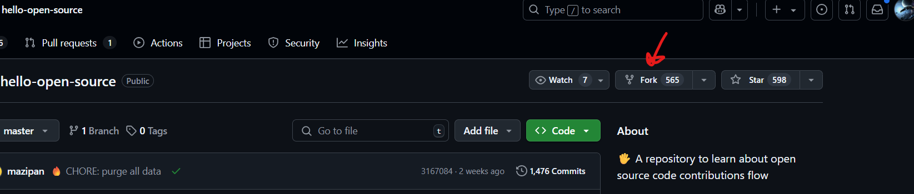
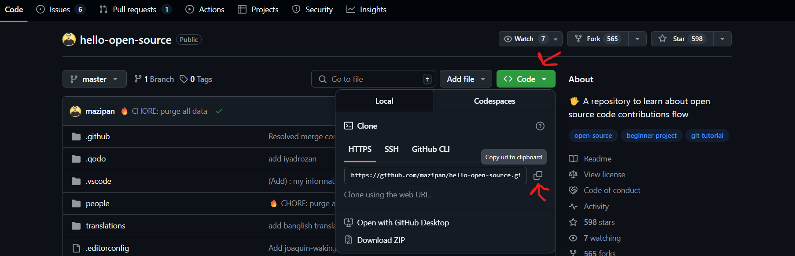

# 👋 Hello Open Source

A repository to **learn open source contribution flow** — perfect for **beginners**! Follow the easy steps below to make your first Pull Request (PR) without stress.

---

## 🌍 Translations Available

You can read this guide in your preferred language:

- [Arabic](./translations/README-AR.md)
- [Bengali](./translations/README-BN.md)
- [Chinese](./translations/README-CHI.md)
- [French](./translations/README-FR.md)
- [German](./translations/README-DE.md)
- [Hindi](./translations/README-HI.md)
- [Hinglish](./translations/README-HINGLISH.md)
- [Hungarian](./translation/README-HU.md)
- [Indonesian](./translations/README-ID.md)
- [Italian](./translations/README-it.md)
- [Japanese](./translations/README-JP.md)
- [Korean](./translations/README-KR.md)
- [Portuguese](./translations/README-PT-BR.md)
- [Russian](./translations/README-RU.md)
- [Spanish](./translations/README-ES.md)
- [Telugu](./translations/README-TE.md)
- [Thai](./translations/README-TH.md)
- [Urdu](./translations/README-UR.md)

---

## 🪜 How to Contribute (Step-by-Step)

> Follow these steps to make your first open-source contribution smoothly.

1. **Fork this repository**
   - Go to the top-right corner of [this repo](https://github.com/mazipan/hello-open-source) and click the `Fork` button.
   - You'll have a copy of this repository in your own GitHub account.
   - Screenshot for this is provided here.
   
   - This will create a copy of the repo under your GitHub account.

2. **Clone your forked repository**
   - Go to your GitHub account and navigate to your forked repository.
   - Click the `Code` button and copy the URL.
   -Screenshot for this is provided here.
   
   - Open your terminal and run:

     ```bash
     git clone https://github.com/YOUR-USERNAME/hello-open-source.git
     ```

   - Replace `YOUR-USERNAME` with your actual GitHub username.

3. **Navigate into the project folder**

   ```bash
   cd hello-open-source


## 🗑️ How do I remove my data?

Remove all data

```shell
yarn purge
```

You can specify a name (or more) to remove only those file(s)

```shell
yarn purge joe-bob kitty-luvr73
```

**❌ I will delete the data periodically.**

## 🚶 Next Step

This repo will introduce open source contribution flow.
After finishing all the steps here, we expect you will have a basic knowledge of how to fork the repository, how a git branch works, how to create a good pull request, and other basic things to make your next contribution in open source code 🥳.

**👉 Do NOT stop here, keep contributing to open-source projects**

<br>

## Contributors

Thanks goes to these wonderful people!


---

Copyright © 2018-present **Irfan Maulana**
